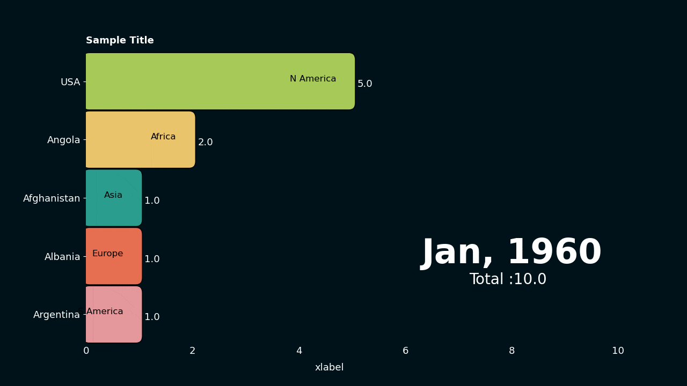

#Examples
```py
from matplotlib import pyplot as plt
import numpy as np
import pandas as pd
import os

dir_path = os.path.dirname(os.path.realpath(__file__))
import pynimate as nim


def post(ax, *args):
    ax.spines["top"].set_visible(False)
    ax.spines["right"].set_visible(False)
    ax.spines["bottom"].set_visible(False)
    ax.spines["left"].set_visible(False)
    ax.set_facecolor("#001219")


df = pd.read_csv(dir_path + "/data/sample.csv").set_index("time")

bar = nim.BarBasic(
    df, "%Y-%m-%d", "3d", post_update=post, rounded_edges=True, grid=False
)
bar.set_bar_color(["red", "blue", "green", "yellow", "pink"])
bar.set_bar_color(
    {
        "Afghanistan": "#2a9d8f",
        "Angola": "#e9c46a",
        "Albania": "#e76f51",
        "USA": "#a7c957",
        "Argentina": "#e5989b",
    }
)
bar.set_figure(figsize=(12.8, 7.2), facecolor="#001219")
bar.set_title("Sample Title", color="w", weight=600)
bar.set_xlabel("xlabel", color="w")
bar.set_time(callback=lambda i, data, time, rank: time[i].strftime("%b, %Y"), color="w")
bar.set_text(
    "sum",
    callback=lambda i, data, *args: f"Total :{np.round(data.iloc[i].sum(),2)}",
    size=20,
    x=0.72,
    y=0.20,
    color="w",
)
bar.set_bar_annots(color="w", size=13)
bar.set_xticks(colors="w", length=0, labelsize=13)
bar.set_yticks(colors="w", labelsize=13)
bar.set_bar_border_props(
    edge_color="black", pad=0.1, mutation_aspect=1, radius=0.2, mutation_scale=0.6
)
bar.animate()
# plt.show()
bar.save("example3", 24, "gif")
```
## Result!
